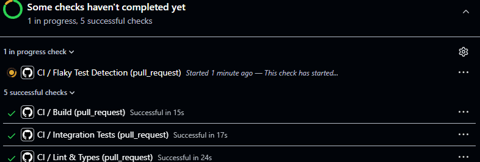

# flaky-finder

[](https://github.com/enoHns/ci-flaky-finder/actions/workflows/ci.yml)
[](LICENSE)

Detects flaky CI jobs and posts a PR comment with failure rate, pattern, and a concrete fix suggestion.



## Quick start

Add this job to your workflow — no extra setup, no config file, no test code changes required:

```yaml
flaky-check:
  runs-on: ubuntu-latest
  if: always()
  needs: [your-test-job]
  permissions:
    actions: read
    pull-requests: write
  steps:
    - uses: enoHns/ci-flaky-finder@main
      with:
        github-token: ${{ github.token }} # Required but available by default
        ai-suggestions: true # Optional
        ai-token: ${{ secrets.AI_TOKEN }}  # with models:read | Optional
```
When `ai-suggestions` is `true`, the last 3 000 chars of the failed job's logs are sent to the AI endpoint. Both the AI suggestion and the built-in baseline fix are shown in the PR comment.

## Inputs

| Input | Default | Description |
|-------|---------|-------------|
| `github-token` | required | Use `${{ github.token }}` — needs `actions:read` + `pull-requests:write` |
| `workflow` | auto | Workflow file to analyze (e.g. `ci.yml`) |
| `lookback-runs` | `30` | Past runs to analyze (paginated, 100 per API page) |
| `post-comment` | `true` | Post/update a PR comment |
| `fail-on-flaky` | `false` | Fail the step if flaky jobs are found |
| `ai-suggestions` | `false` | Analyze job logs with an LLM for targeted fix suggestions |
| `ai-model` | `gpt-4o-mini` | Any model on [GitHub Models](https://github.com/marketplace/models) |
| `ai-token` | `github-token` | Classic PAT or fine-grained PAT with `models: read` |
| `ai-endpoint` | GitHub Models | Override with any OpenAI-compatible endpoint |


## Patterns

| Pattern | Signal |
|---------|--------|
| `intermittent` | Random pass/fail in recent runs |
| `slow-degrading` | Duration increasing over time (Pearson r > 0.8) |
| `time-dependent` | Failures cluster at specific UTC hours across multiple days |
| `resource-sensitive` | High duration variance (CV > 40%) with at least one failure |
| `runner-dependent` | Failures concentrated on a specific runner (> 60% fail rate on that runner) |

## Scope and limitations

- Analyzes CI **jobs**, not individual test results — no JUnit XML parsing
- Requires >= 5 runs per job to report anything
- History window: up to 90 days (GitHub default workflow run retention)
- AI suggestions only fire when there is a recent failed job with accessible logs

## Privacy

Reads workflow metadata via GitHub API. Nothing leaves GitHub infrastructure.
When ai-suggestions: true, the last 3 000 chars of failed job logs are sent to the configured AI endpoint.

## License

MIT
